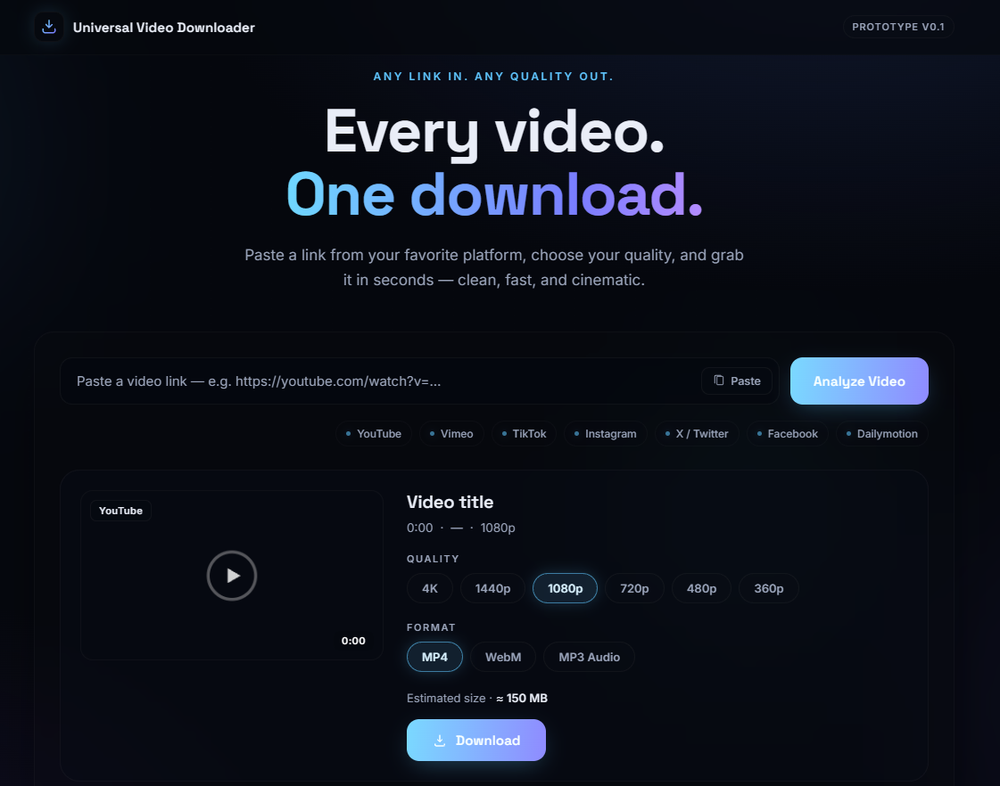

# Universal Video Downloader

A small self-hosted web app that lets you download a video from a public link by pasting
it into a browser page, picking a quality and format, and watching a live progress bar.

You run one Python command, open the page in your browser, and the app fetches the video
for you. There is no build step, no database, and no account.

> **Please read the [Usage & legal note](#usage--legal-note) before using this project.**

---

## UI Preview



## Features

- **Paste a link and go** — one input box, one *Analyze* button, one *Download* button.
- **Supported platforms:** YouTube, Vimeo, TikTok, Instagram, X / Twitter, Facebook,
  Dailymotion.
- **Quality selection:** 360p, 480p, 720p, 1080p, 1440p and 4K (2160p). Qualities the
  selected video does not offer are automatically greyed out after analysis.
- **Format selection:** `MP4`, `WebM` video, or `MP3` audio-only.
- **Video preview panel** showing the title, platform, duration and an estimated file
  size before you commit to downloading.
- **Live progress bar** with percentage and transfer speed, streamed from the server.
- **One-click paste** from the clipboard.
- **Automatic file save** — when the download finishes the browser saves it with the
  video's real title as the filename.
- **Friendly error messages** for common problems (private video, region-locked,
  needs login, missing ffmpeg, and so on).
- **Temporary-file design** — downloads are written to a temporary server folder and cleaned up after each download. When running locally, the app is available on your machine; when deployed, the same backend can serve the public web app.

---

## Technologies used

| Layer | Technology |
| --- | --- |
| Backend | Python 3 — standard library `http.server.ThreadingHTTPServer` |
| Download engine | [`yt-dlp`](https://github.com/yt-dlp/yt-dlp) |
| Media tooling | `ffmpeg` (from your `PATH`, or provided by the optional `imageio-ffmpeg` package) |
| Frontend | Plain HTML, CSS and JavaScript — no framework, no build step |
| Progress updates | Server-Sent Events (SSE) |
| Fonts | Google Fonts (Inter, Space Grotesk) |

There is no `package.json`, no bundler and no `requirements.txt`. The only required
Python package is `yt-dlp`.

---

## Project structure

```
Universal-Video-Downloader-/
├── index.html     # The page you see in the browser
├── style.css      # Layout and styling
├── script.js      # Frontend logic: analyze, progress, save the file
├── server.py      # Python backend: serves the page and drives yt-dlp
├── README.md      # This file
└── .gitignore
```

---

## Public deployment

GitHub Pages can host the HTML/CSS/JS, but it cannot run `server.py`. For a single public URL where the frontend **and** Python backend run together, deploy this repository as a **Render Web Service**. The repository already includes `render.yaml` and `requirements.txt` for this setup.

1. Open Render and create a **New → Web Service**.
2. Connect `ThechillBoy/Universal-Video-Downloader`.
3. Use the repository's `render.yaml` configuration (or set Build Command to `pip install -r requirements.txt` and Start Command to `python server.py`).
4. Deploy and open the generated `*.onrender.com` URL.

The service must listen on `0.0.0.0`; `server.py` is configured to do that when deployed. Render documents that public web services must bind to `0.0.0.0`. citeturn0search2

> Free Render web services are intended for testing/hobby use, can spin down after 15 minutes of inactivity, and have an ephemeral filesystem. Large video downloads can also consume bandwidth quickly. citeturn0search0

## How to run it locally

You need **Python 3** installed. These steps use Windows Command Prompt; the commands
are the same in PowerShell, with `python`/`py` available on your `PATH`.

### 1. Get the project

```bash
git clone https://github.com/ThechillBoy/Universal-Video-Downloader.git
cd Universal-Video-Downloader
```

### 2. (Recommended) Create a virtual environment

```bash
python -m venv .venv
```

Activate it:

```cmd
.venv\Scripts\activate
```

You should see `(.venv)` at the start of your prompt.

### 3. Install the dependencies

```bash
python -m pip install --upgrade pip
pip install yt-dlp
```

Optional but recommended — supplies `ffmpeg` automatically so high-quality video
streams can be merged and MP3 files can be extracted:

```bash
pip install imageio-ffmpeg
```

> If you already have `ffmpeg` installed on your `PATH`, you can skip this.

### 4. Start the server

```bash
python server.py
```

You will see something like:

```
Universal Video Downloader backend
Frontend: http://127.0.0.1:8321
Uses yt-dlp 2026.8.19 | workdir /tmp/uvd-xxxx
```

### 5. Open the app

Open this address in your browser:

```
http://127.0.0.1:8321
```

Leave the terminal window running. Press `Ctrl + C` in it to stop the server.

To use a different port, set the `PORT` environment variable before starting:

```cmd
set PORT=9000
python server.py
```

---

## How to download a video

1. **Paste the video link** into the input box at the top of the page. You can use the
   **Paste** button, or press `Ctrl + V`.
2. Click **Analyze Video**. The app reads the link and shows the video's title,
   platform and duration.
3. **Choose a quality** — `360p`, `480p`, `720p`, `1080p`, `1440p` or `4K`. Options the
   video does not offer are greyed out and cannot be selected.
4. **Choose a format** — `MP4`, `WebM`, or `MP3` for audio only.
5. Check the **estimated size** shown below the selectors (this is an estimate, not the
   exact final size).
6. Click **Download**. A progress bar appears with the percentage and current speed.
7. When it reaches **100 %**, your browser automatically saves the file. The filename is
   the video's real title.
8. Click **Download another video** to start over with a different link.

### Troubleshooting

| Symptom | What to do |
| --- | --- |
| *"Backend required: run python server.py"* | The server is not running. Start it with `python server.py` and reload the page. |
| *"Cannot reach the backend server"* | The server stopped or another program is using port 8321. Check your terminal, or set a different `PORT`. |
| *"Unsupported platform"* | Only the listed public platforms are accepted. |
| *"This video requires login"* / *"private or restricted"* | Only public videos are supported. This app never uses your account or cookies. |
| *"Server video tools are missing (ffmpeg)"* | Install it with `pip install imageio-ffmpeg`, or install `ffmpeg` on your `PATH`. |
| *"Not available in your region"* | The video is geo-blocked where the server is running. |

---

## Usage & legal note

This project is provided **for educational and personal use only**.

- **Only download videos you own, videos that are in the public domain, or content you
  have explicit permission to download.**
- Downloading copyrighted material without authorization may violate copyright law and
  the terms of service of the platform it is hosted on. You are **solely responsible**
  for how you use this tool.
- The app deliberately supports **public links only**. It does not log in, use cookies,
  bypass paywalls, or defeat DRM — please do not add such features.
- The authors of this repository accept no liability for misuse.

When in doubt, do not download it.

---

## License

No license file is included in this repository. Add one before redistributing.
